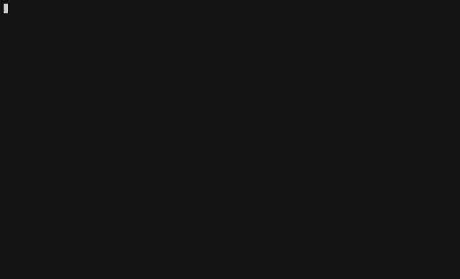

# Worque
[](https://travis-ci.org/huynhquancam/worque)
[](https://badge.fury.io/rb/worque)

Worque is a CLI which is helpful to manage your daily notes.

* Ever stunned when your boss suddenly asked what you've done yesterday?
* Wanna check/note your daily tasks without exiting your favourite editor `VIM`?
* Something to report on daily stand-ups?

Then worque is definitely a right tool for you!

## HOW IT WORKS



### WITH VIM


## Installation

**DO NOT add this to your Gemfile**

Install it by

    $ gem install worque

Or, if you're using RVM and want the command available system-wide while keeping it in its own gemset

    $ rvm default@worque --create do gem install worque
    $ rvm wrapper default@worque --no-prefix worque

## Quick start guide

### CLI

#### `worque todo`

Add this to your `.bash_profile`

```sh
export WORQUE_PATH='/path/to/your/notes'
```

I often map it to my Dropbox like this

```sh
export WORQUE_PATH='~/Dropbox/Notes/Todos'
```

Then executing the command below will create a today's note for you

```sh
worque todo --for today
# ~/notes/notes-2016-07-19.md
```

Or look back what's done yesterday.

```sh
workque todo --for=yesterday
# ~/notes/checklist-2016-07-18.md
# This will jump back to Friday's note if it's Monday today!
```

If you're kind of nerd and you have no life. You would rather work over the weekend than hanging out with folks, so you should enable the **hardcore** mode which will stop skipping weekend for you.

```sh
worque todo --for yesterday --no-skip-weekend
```

You can also explicitly specify the file path

```sh
worque todo --for today --path ~/path/to/your/notes
```

It's chain-able with other commands

```sh
vim worque
vim $(worque todo --for yesterday)
cat $(worque todo --for=yesterday) | grep pending
```

Personally I alias it like `today` like this, so vim will automatically open the
file when I type `today`

```sh
alias today="vim $(worque todo) +':cd $WORQUE_PATH'"
alias ytd="vim $(worque todo) +':cd $WORQUE_PATH'"
```

#### `worque push`

Please remember to add `SLACK_API_TOKEN` in your `.bash_profile`

```sh
export SLACK_API_TOKEN=very-$3Cr3T
```

Then the note for today will be automatically posted to the channel specified.

```sh
worque push --channel=daily-report
```

Alternatively, you can choose to push the note for yesterday

```sh
worque push --channel daily-report --for yesterday
```

### VIM Integration

Add this to your VIM plugin manager

```viml
Plug 'huynhquancam/vim-worque'
```

Then `:TD`, `:YTD` for today and yesterday's notes respectively.

Read more about [vim-worque](https://github.com/huynhquancam/vim-worque).

View more in my [dotfiles](https://github.com/huynhquancam/dotfiles)

## Development

```sh
bundle install
bundle exec rake test
```

## To be implemented

Something in my plan:

* `worque list`: List all notes you have.
* `worque changelog`: Sync your Git commits to daily notes.

## Contributing

Bug reports and pull requests are welcome on GitHub at [https://github.com/huynhquancam/worque/issues](https://github.com/huynhquancam/worque/issues).

## License

The gem is available as open source under the terms of the
[MIT License](http://opensource.org/licenses/MIT).

